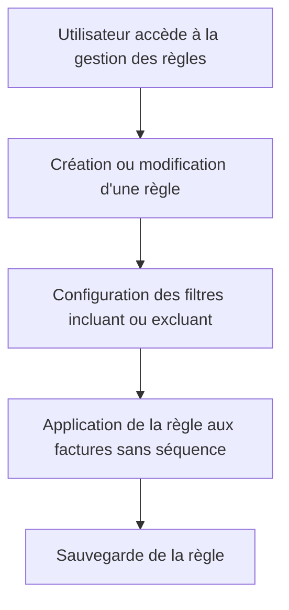

# Use Case: Règles d'Attribution Automatique

## Description
L'utilisateur crée des règles pour attribuer automatiquement des séquences aux factures impayées, avec des filtres incluant ou excluant. Le système applique les règles et met à jour les associations.

## User Flow


## ASCII Screen
```
+---------------------------------------------------------------+
|  Règles d'Attribution Automatique                             |
|                                                               |
|  Filtres:                                                      |
|  - Inclure: Montant > 1000€                                    |
|  - Exclure: Factures réglées                                    |
|                                                               |
|  [Appliquer] [Sauvegarder] [Annuler]                           |
+---------------------------------------------------------------+
```