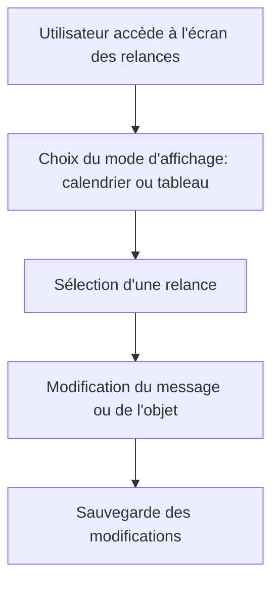

# Use Case: Affichage des Relances

## Description
L'utilisateur visualise les relances dans un calendrier ou un tableau. Le système affiche les détails des relances et permet de modifier les messages avant envoi.

## User Flow


## ASCII Screen
```
+---------------------------------------------------------------+
|  Affichage des Relances                                       |
|                                                               |
|  Mode d'affichage: [Calendrier ▼] [Tableau ▼]                 |
|                                                               |
|  Relances:                                                     |
|  - 15/10/2023: Relance pour Facture 001                        |
|  - 16/10/2023: Relance pour Facture 002                        |
|                                                               |
|  [Modifier] [Exporter]                                         |
+---------------------------------------------------------------+
```