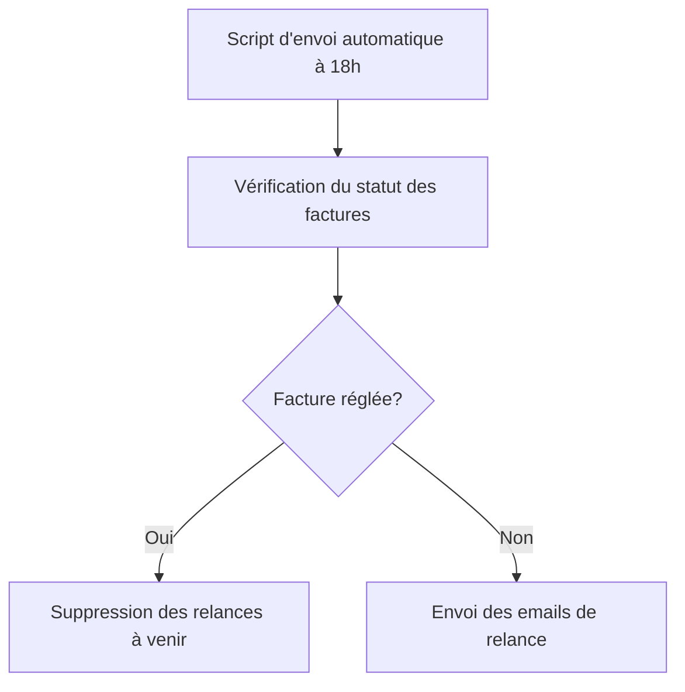

# Use Case: Envoi Automatique des Emails

## Description
Le système envoie les emails de relance quotidiennement à 18h. Avant l'envoi, le système vérifie si les factures sont réglées et supprime les relances si nécessaire.

## User Flow


## ASCII Screen
```
+---------------------------------------------------------------+
|  Envoi Automatique des Emails                                 |
|                                                               |
|  Statut: Envoi en cours...                                    |
|                                                               |
|  Factures vérifiées: 10                                        |
|  Emails envoyés: 8                                            |
|  Relances supprimées: 2                                       |
|                                                               |
|  [Voir les détails] [Exporter le rapport]                     |
+---------------------------------------------------------------+
```