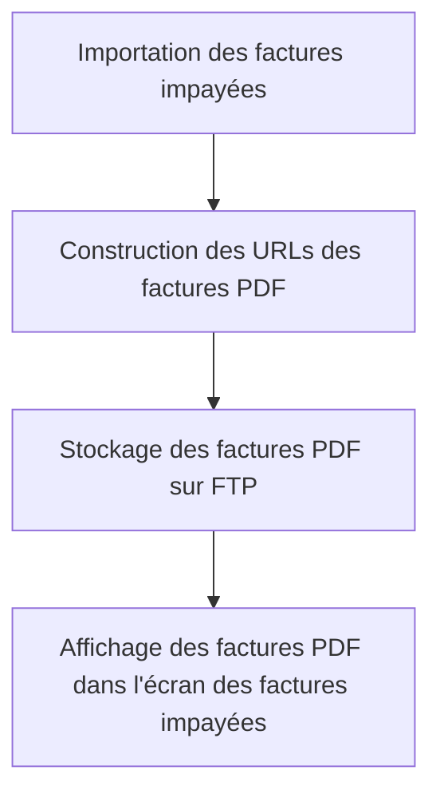

# Use Case: Gestion des Factures PDF

## Description
Le système stocke les factures PDF sur un FTP et construit les URLs des fichiers. L'utilisateur visualise les factures PDF depuis l'écran des factures impayées.

## User Flow


## ASCII Screen
```
+---------------------------------------------------------------+
|  Gestion des Factures PDF                                     |
|                                                               |
|  Factures PDF:                                                 |
|  - Facture 001: [Voir] [Télécharger]                           |
|  - Facture 002: [Voir] [Télécharger]                           |
|                                                               |
|  [Exporter]                                                    |
+---------------------------------------------------------------+
```