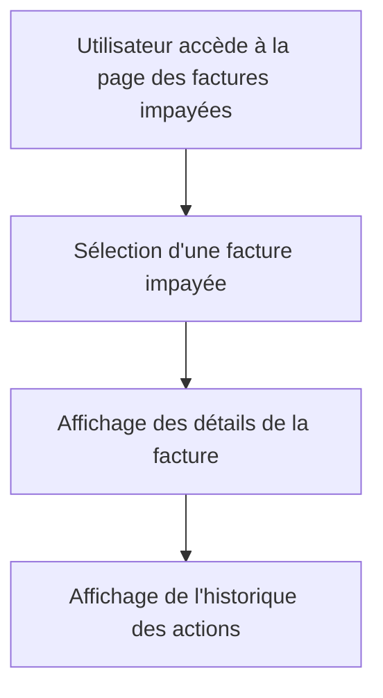

# Use Case: Page Détails des Factures Impayées

## Description
L'utilisateur visualise toutes les informations et actions pour une facture impayée. Le système affiche les détails et l'historique des actions.

## User Flow


## ASCII Screen
```
+---------------------------------------------------------------+
|  Détails de la Facture Impayée                                |
|                                                               |
|  Facture: 001                                                  |
|  Montant: 1000€                                                |
|  Date d'échéance: 15/10/2023                                   |
|                                                               |
|  Historique des actions:                                       |
|  - 10/10/2023: Relance envoyée                                 |
|  - 12/10/2023: Rappel téléphonique                            |
|                                                               |
|  [Modifier] [Exporter]                                         |
+---------------------------------------------------------------+
```