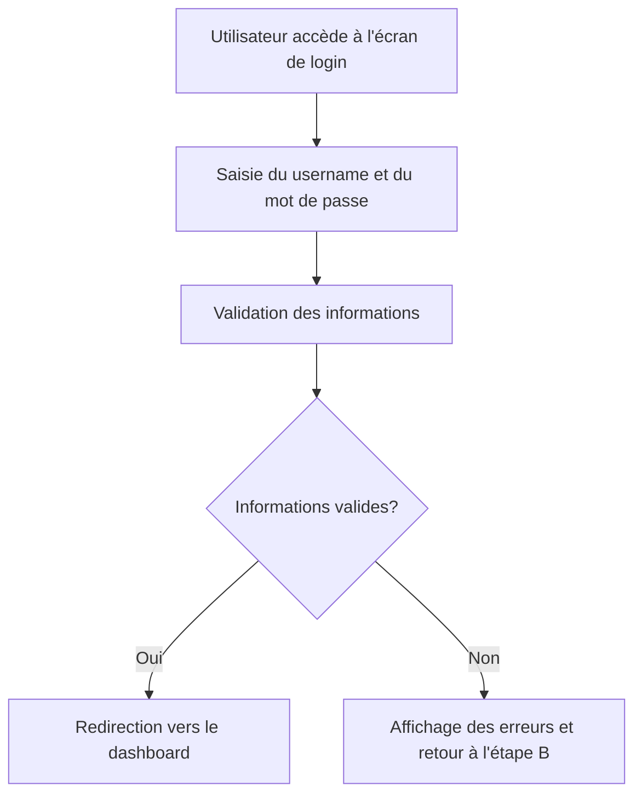

# Use Case: Authentification et Dashboard

## Description
L'utilisateur se connecte avec un username et accède au dashboard. Le système affiche des informations pertinentes sur le dashboard.

## User Flow


## ASCII Screen
```
+---------------------------------------------------------------+
|  Authentification                                              |
|                                                               |
|  Username: [_______________________________________________]  |
|  Mot de passe: [___________________________________________]  |
|                                                               |
|  [Se connecter] [Mot de passe oublié?]                        |
|                                                               |
|  Messages:                                                     |
|  - Connexion réussie.                                          |
|  - Erreur: Username ou mot de passe incorrect.                |
+---------------------------------------------------------------+
```