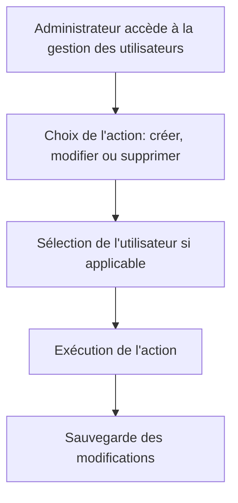

# Use Case: Gestion des Utilisateurs

## Description
L'administrateur (`admin=true`) gère les utilisateurs de son équipe. Le système permet de créer, modifier et supprimer des utilisateurs.

## User Flow


## ASCII Screen
```
+---------------------------------------------------------------+
|  Gestion des Utilisateurs                                     |
|                                                               |
|  Utilisateurs:                                                 |
|  - Jean Dupont: [Modifier] [Supprimer]                         |
|  - Marie Martin: [Modifier] [Supprimer]                        |
|                                                               |
|  [Ajouter un utilisateur] [Exporter]                           |
+---------------------------------------------------------------+
```