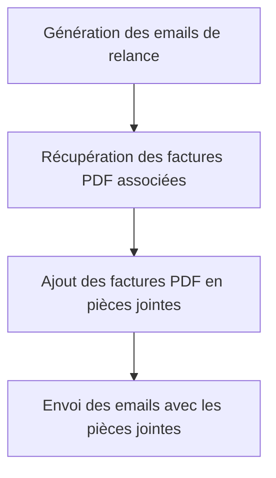

# Use Case: Pièces Jointes des Factures

## Description
Le système joint les factures PDF aux emails de relance. Les factures PDF doivent être incluses dans les emails envoyés.

## User Flow


## ASCII Screen
```
+---------------------------------------------------------------+
|  Pièces Jointes des Factures                                  |
|                                                               |
|  Email de relance:                                             |
|  - Destinataire: jean.dupont@example.com                       |
|  - Pièces jointes: Facture_001.pdf                            |
|                                                               |
|  [Envoyer] [Annuler]                                           |
+---------------------------------------------------------------+
```