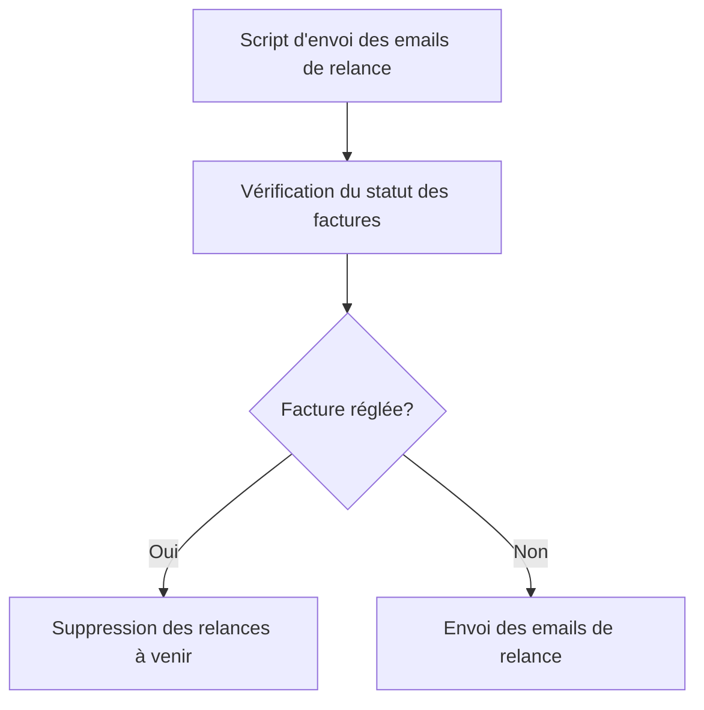

# Use Case: Vérification des Factures Réglées

## Description
Le système vérifie si une facture est réglée avant l'envoi des relances. Si la facture est réglée, les relances à venir sont supprimées.

## User Flow


## ASCII Screen
```
+---------------------------------------------------------------+
|  Vérification des Factures Réglées                            |
|                                                               |
|  Factures vérifiées: 10                                        |
|  Factures réglées: 2                                           |
|  Relances supprimées: 2                                       |
|                                                               |
|  [Voir les détails] [Exporter le rapport]                     |
+---------------------------------------------------------------+
```