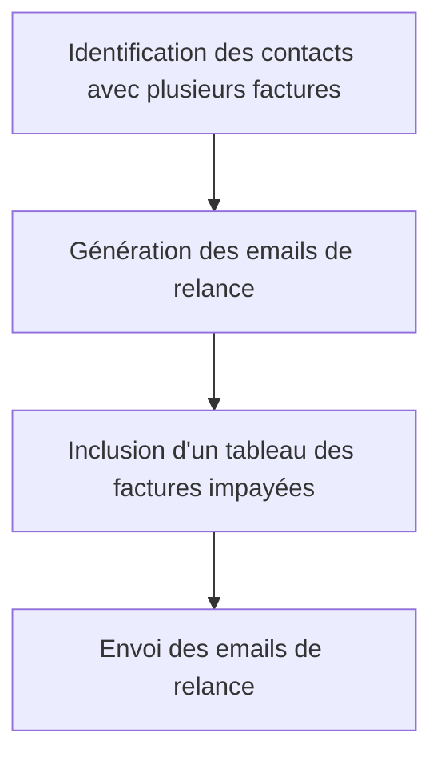

# Use Case: Gestion des Multiples Factures

## Description
Le système gère les cas où un contact a plusieurs factures impayées. Les emails de relance doivent inclure un tableau des factures impayées.

## User Flow


## ASCII Screen
```
+---------------------------------------------------------------+
|  Gestion des Multiples Factures                               |
|                                                               |
|  Contact: Jean Dupont                                         |
|  Factures impayées:                                           |
|  - Facture 001: Montant: 1000€                                 |
|  - Facture 002: Montant: 1500€                                 |
|                                                               |
|  [Envoyer une relance] [Exporter]                              |
+---------------------------------------------------------------+
```