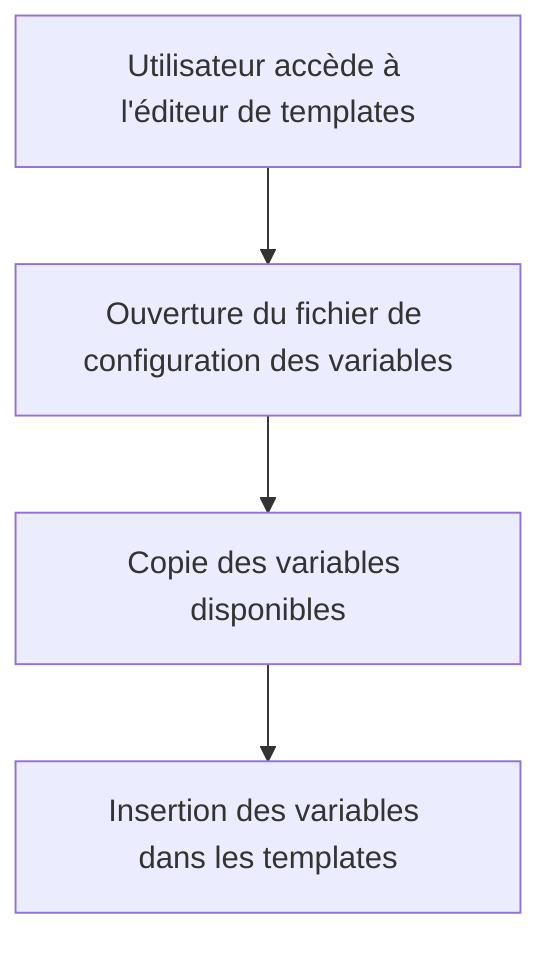

# Use Case: Fichier de Configuration des Variables

## Description
Le système utilise un fichier `/static/configs/variables.json` pour les variables disponibles. Les variables doivent être accessibles et copiables pour être utilisées dans les templates d'emails.

## User Flow


## ASCII Screen
```
+---------------------------------------------------------------+
|  Fichier de Configuration des Variables                       |
|                                                               |
|  Variables disponibles:                                        |
|  - [[nom]]                                                     |
|  - [[montant]]                                                 |
|  - [[date]]                                                    |
|                                                               |
|  [Copier] [Fermer]                                             |
+---------------------------------------------------------------+
```