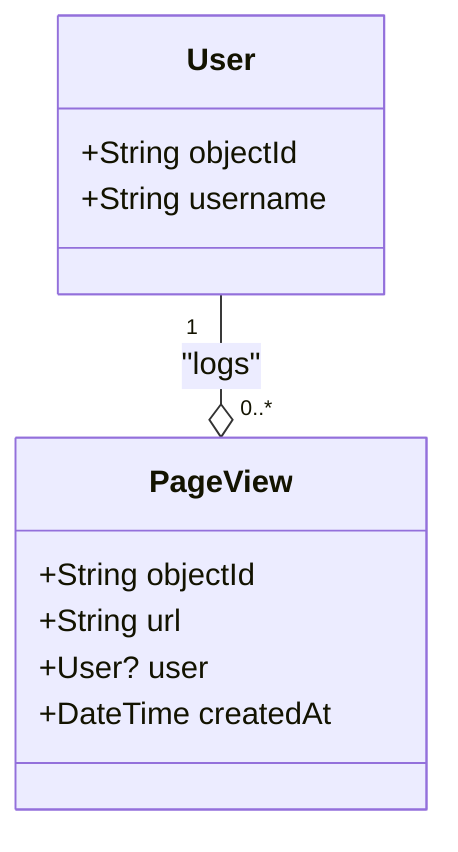

# **Steroids Studio – Méthodologie de Développement avec User Stories et Garde-fous**
*Structure optimisée pour une traçabilité par US, avec Mermaid.md, ASCII, et micro-étapes.*

---

## **1. Structure des Dossiers (Exemple pour F18)**
```bash
steriods-studio/
├── docs/
│   ├── specs/
│   │   ├── fonctionnelles/
│   │   │   └── F18.md               # Spécifications fonctionnelles + User Stories
│   │   └── techniques/
│   │       └── F18.md               # Diagrammes Mermaid + Garde-fous techniques
│   └── scenarios/
│       └── F18/
│           ├── user-stories/
│           │   ├── US1/
│           │   │   ├── implementation.md  # Détail de l'implémentation pour US1
│           │   │   ├── console/           # Logs spécifiques à US1
│           │   │   │   ├── web.log
│           │   │   │   ├── parse-serveur.log
│           │   │   │   └── astro.log
│           │   │   └── tools/             # Scripts de test pour US1
│           │   │       ├── test-us1-parse.sh
│           │   │       └── setup-mocks.js
│           │   └── US2/
│           │       ├── implementation.md  # Détail de l'implémentation pour US2
│           │       ├── console/
│           │       │   ├── web.log
│           │       │   └── parse-serveur.log
│           │       └── tools/
│           │           └── test-us2-cloud-code.sh
│           └── ascii/                   # Écrans ASCII (si applicable)
│               └── F18-us1-flow.txt      # Flux ASCII pour US1
├── src/                              # Code source (Alpine.js, Astro, Tailwind)
├── cloud/                            # Parse Cloud Code
├── tests/
│   ├── playwright/
│   │   └── F18/
│   │       ├── US1/                   # Tests Playwright pour US1
│   │       │   ├── 1-hello-world.spec.js
│   │       │   └── 2-dynamic-message.spec.js
│   │       └── US2/                   # Tests Playwright pour US2
│   │           └── 1-log-visit.spec.js
│   └── mcp/
│       ├── F18/
│       │   ├── US1/                  # Tests MCP pour US1
│       │   │   └── user-store.test.js
│       │   └── US2/                  # Tests MCP pour US2
│       │       └── logPageView.test.js
└── public/                           # Fichiers statiques (JS, images)
```

---

## **2. Spécifications Fonctionnelles (F18) avec User Stories**
**Fichier** : `docs/specs/fonctionnelles/F18.md`

```markdown
# F18 : Page Dynamique avec Message Personnalisé

## Contexte
Améliorer l'engagement utilisateur en affichant un message personnalisé et en traçant les visites pour analyse.

---

## User Stories

### US1 : Afficher un Message Personnalisé
**En tant qu'** utilisateur (connecté ou non),
**Je veux** voir un message d'accueil personnalisé sur `/nouvelle-page`,
**Afin de** me sentir reconnu et engagé.

**Critères d'Acceptation** :
- [ ] Message "Hello [Nom]" si connecté, "Hello Invité" sinon.
- [ ] Temps de chargement < 500ms.
- [ ] Compatible mobile/desktop (Tailwind CSS).

**Scénarios** :
1. **Utilisateur connecté** :
   - Étant donné que je suis connecté avec le nom "Oswald Bernard",
   - Quand je visite `/nouvelle-page`,
   - Alors je vois "Hello Oswald Bernard".

2. **Utilisateur non connecté** :
   - Étant donné que je ne suis pas connecté,
   - Quand je visite `/nouvelle-page`,
   - Alors je vois "Hello Invité".

**Lien vers l'implémentation** : [`docs/scenarios/F18/user-stories/US1/implementation.md`](US1/implementation.md)

---

### US2 : Logger les Visites pour Analyse
**En tant qu'** administrateur,
**Je veux** que les visites sur `/nouvelle-page` soient enregistrées dans Parse,
**Afin de** pouvoir analyser le trafic et l'engagement.

**Critères d'Acceptation** :
- [ ] Chaque visite est enregistrée dans la table `PageView` avec :
  - `url` (ex: "/nouvelle-page"),
  - `user` (Pointer vers User, ou `null`),
  - `createdAt` (horodatage).
- [ ] Les logs sont accessibles via Parse Dashboard.
- [ ] Rate-limiting : 1 log par utilisateur/page toutes les 5 minutes.

**Scénarios** :
1. **Visite enregistrée** :
   - Étant donné qu'un utilisateur (connecté ou non) visite `/nouvelle-page`,
   - Quand la page est chargée,
   - Alors une entrée est créée dans `PageView`.

**Lien vers l'implémentation** : [`docs/scenarios/F18/user-stories/US2/implementation.md`](US2/implementation.md)

---

## Garde-fous Fonctionnels
- **Performance** :
  - Limiter à 2 requêtes Parse max par page (1 pour l'utilisateur, 1 pour le log).
  - Utiliser un cache local pour éviter les appels redondants à `Parse.User.current()`.
- **Données** :
  - Vérifier que la table `PageView` existe avec les champs requis et les index :
    ```sql
    -- Vérifier via Parse Dashboard ou cURL
    curl -X GET \
      -H "X-Parse-Application-Id: $PARSE_APP_ID" \
      -H "X-Parse-Master-Key: $PARSE_MASTER_KEY" \
      "http://localhost:1337/parse/schemas/PageView"
    ```
- **Sécurité** :
  - Restreindre les permissions de `PageView` aux rôles `admin` uniquement.
  - Ne jamais exposer les clés Parse dans le code frontend (utiliser `.env`).
```

---

## **3. Spécifications Techniques (F18)**
**Fichier** : `docs/specs/techniques/F18.md`

```markdown
# F18 : Spécifications Techniques

## Diagrammes Mermaid

### Flux Principal (US1 + US2)
```mermaid
flowchart TD
    A[Navigateur: /nouvelle-page] --> B[Astro: Rendu HTML]
    B --> C[Alpine.js: Initialisation]
    C -->|Parse.User.current()| D[Parse SDK]
    D -->|User/Error| C
    C -->|Affiche Message (US1)| A
    C -->|logPageView (US2)| E[Parse Cloud Code]
    E -->|Enregistre| F[(Parse: PageView)]

    classDef frontend fill:#f96,stroke:#333;
    class A,B,C frontend
    classDef backend fill:#9f9,stroke:#333;
    class D,E,F backend
```

### Schéma Parse (US2)


### Écran ASCII (US1)
```
┌───────────────────────┐
│   Steroids Studio     │  ← Header (BaseLayout)
├───────────────────────┤
│                       │
│   Hello Oswald Bernard│  ← Message dynamique (Alpine.js)
│                       │
├───────────────────────┤
│   © 2026              │  ← Footer (BaseLayout)
└───────────────────────┘
```
*(Fichier : `docs/scenarios/F18/ascii/F18-us1-flow.txt`)*

---

## Garde-fous Techniques
- **Frontend (US1)** :
  - **Alpine.js** :
    - Vérifier que `Alpine.store('user')` est initialisé avant utilisation :
      ```javascript
      // Dans src/js/stores/user.store.js
      if (!Alpine.store('user')) {
        console.error("Alpine store 'user' non initialisé");
      }
      ```
  - **Astro** :
    - Valider que `BaseLayout` est bien intégré (test Playwright sur les éléments `header` et `footer`).
- **Backend (US2)** :
  - **Parse Cloud Code** :
    - Ajouter un timeout de 2s max pour `logPageView` :
      ```javascript
      Parse.Cloud.job("logPageView", async (request) => {
        await new Promise(resolve => setTimeout(resolve, 2000)); // Timeout simulé
      });
      ```
  - **Requêtes Parse** :
    - Utiliser un singleton pour `Parse.initialize()` dans `public/js/parse-utils.js`.
```

---

## **4. Implémentation par User Story**

---

### **US1 : Afficher un Message Personnalisé**
**Fichier** : `docs/scenarios/F18/user-stories/US1/implementation.md`

```markdown
# US1 : Implémentation - Message Personnalisé

## Micro-Étapes

### Étape 1 : Page "Hello World"
**Fichiers** :
- `src/pages/nouvelle-page.astro`
- `tests/playwright/F18/US1/1-hello-world.spec.js`

#### Code
```astro
---
// src/pages/nouvelle-page.astro
---
<html>
  <body>
    <h1>Hello World</h1>
  </body>
</html>
```

#### Test Playwright
```javascript
// tests/playwright/F18/US1/1-hello-world.spec.js
test('Affichage basique', async ({ page }) => {
  await page.goto('/nouvelle-page');
  await expect(page.locator('h1')).toHaveText('Hello World');
});
```

#### Garde-fous
- **Route** : Vérifier que `/nouvelle-page` est accessible (test 404 si manquante).
- **Fallback** : Prévoir un message d'erreur si Astro échoue à rendre la page.

#### Commit
```bash
git add src/pages/nouvelle-page.astro tests/playwright/F18/US1/1-hello-world.spec.js
git commit -m "[F18-US1] Étape 1 : Page basique
- Ajout de la route /nouvelle-page
- Test d'affichage minimal
- Garde-fou : Gestion des erreurs de routage"
```

---

### Étape 2 : Intégrer BaseLayout
**Fichiers** :
- `src/layouts/BaseLayout.astro`
- `src/pages/nouvelle-page.astro` (mis à jour)

#### Code
```astro
---
// src/layouts/BaseLayout.astro
---
<html lang="fr">
  <head>
    <title>Steroids Studio</title>
  </head>
  <body class="min-h-screen flex flex-col">
    <header class="bg-blue-500 text-white p-4">Steroids Studio</header>
    <main class="flex-grow p-4"><slot /></main>
    <footer class="bg-gray-800 text-white p-4 text-center">© 2026</footer>
  </body>
</html>
```

#### Garde-fous
- **Tailwind** : Vérifier que les classes CSS sont purges correctement (`npx tailwindcss -o public/styles/global.css --minify`).
- **Accessibilité** :
  - Contraste suffisant (ratio 4.5:1 pour le texte).
  - Balises ARIA si nécessaire (ex: `aria-label` pour le header).

#### Commit
```bash
git add src/layouts/BaseLayout.astro src/pages/nouvelle-page.astro
git commit -m "[F18-US1] Étape 2 : Intégration BaseLayout
- Layout responsive avec Tailwind
- Validation des contrastes (WCAG 2.1)"
```

---

### Étape 3 : Message Dynamique avec Alpine.js
**Fichiers** :
- `src/js/stores/user.store.js`
- `src/pages/nouvelle-page.astro` (mis à jour)

#### Code
```javascript
// src/js/stores/user.store.js
document.addEventListener('alpine:init', () => {
  Alpine.store('user', {
    current: null,
    init() {
      // Simulation pour les tests
      this.current = { get: () => "Oswald Bernard" };
    },
    getUsername() {
      return this.current?.get('username') || 'Invité';
    }
  });
});
```

#### Garde-fous
- **Alpine.js** :
  - Vérifier que le store est disponible avant utilisation :
    ```javascript
    if (!window.Alpine) {
      console.error("Alpine.js non chargé");
    }
    ```
- **Fallback** : Toujours retourner "Invité" si `current` est `null` ou indéfini.

#### Commit
```bash
git add src/js/stores/user.store.js src/pages/nouvelle-page.astro
git commit -m "[F18-US1] Étape 3 : Message dynamique
- Store Alpine pour l'utilisateur
- Fallback sur 'Invité'
- Tests de réactivité et d'erreurs"
```

---

### Étape 4 : Intégrer Parse SDK
**Fichiers** :
- `public/js/parse-utils.js`
- `src/js/stores/user.store.js` (mis à jour)

#### Code
```javascript
// public/js/parse-utils.js
let parseInitialized = false;
export function initParse() {
  if (parseInitialized) return;
  Parse.initialize("YOUR_APP_ID", "YOUR_JS_KEY");
  Parse.serverURL = 'https://your-parse-server.com/parse';
  parseInitialized = true;
}
```

#### Garde-fous
- **Parse** :
  - **Singleton** : Empêcher les initialisations multiples.
  - **Erreurs** : Capturer et logger les erreurs de `Parse.User.current()` :
    ```javascript
    try {
      this.current = await Parse.User.current();
    } catch (error) {
      console.error('Parse Error:', error);
      this.current = null;
    }
    ```
- **Sécurité** : Vérifier que les clés ne sont pas dans le repo (`git grep "PARSE_APP_ID"`).

#### Test Playwright
```javascript
// tests/playwright/F18/US1/4-parse-integration.spec.js
test('Fallback si Parse échoue', async ({ page }) => {
  await page.route('**/parse/users/me', route => route.abort());
  await page.goto('/nouvelle-page');
  await expect(page.locator('h1')).toHaveText('Hello Invité');
});
```

#### Commit
```bash
git add public/js/parse-utils.js src/js/stores/user.store.js
git commit -m "[F18-US1] Étape 4 : Intégration Parse
- Initialisation sécurisée (singleton)
- Gestion des erreurs (fallback)
- Tests d'échec Parse"
```

---

### **US2 : Logger les Visites pour Analyse**
**Fichier** : `docs/scenarios/F18/user-stories/US2/implementation.md`

```markdown
# US2 : Implémentation - Logging des Visites

## Micro-Étapes

### Étape 1 : Cloud Function logPageView
**Fichiers** :
- `cloud/functions/logPageView.js`
- `tests/mcp/F18/US2/logPageView.test.js`

#### Code
```javascript
// cloud/functions/logPageView.js
Parse.Cloud.define('logPageView', async (request) => {
  const { page } = request.params;
  const PageView = Parse.Object.extend('PageView');

  // Rate-limiting : 1 log par utilisateur/page toutes les 5 min
  const lastLog = await new Parse.Query('PageView')
    .equalTo('url', page)
    .equalTo('user', request.user)
    .greaterThan('createdAt', new Date(Date.now() - 5 * 60 * 1000))
    .first();

  if (lastLog) return 'Already logged';

  const log = new PageView();
  log.set('url', page);
  log.set('user', request.user);
  await log.save();
  return 'Logged';
});
```

#### Garde-fous
- **Parse** :
  - **Index** : Vérifier que `PageView` a un index composite sur `url` et `createdAt`.
  - **Permissions** : Restreindre l'écriture à `PageView` aux rôles `admin` :
    ```javascript
    // Dans Parse Dashboard ou via cURL
    curl -X PUT \
      -H "X-Parse-Application-Id: $PARSE_APP_ID" \
      -H "X-Parse-Master-Key: $PARSE_MASTER_KEY" \
      -H "Content-Type: application/json" \
      -d '{"className": "PageView", "writePermissions": ["admin"]}' \
      "http://localhost:1337/parse/schemas/PageView"
    ```
- **Cloud Code** :
  - **Timeout** : Limiter à 2s max :
    ```javascript
    const timeout = 2000;
    const controller = new AbortController();
    setTimeout(() => controller.abort(), timeout);
    ```

#### Test MCP
```javascript
// tests/mcp/F18/US2/logPageView.test.js
jest.mock('@parse/js');
test('Rate-limiting fonctionnel', async () => {
  Parse.Object.extend.mockImplementation(() => ({
    save: jest.fn().mockResolvedValue({}),
  }));
  const result1 = await Parse.Cloud.run('logPageView', { page: '/nouvelle-page' });
  const result2 = await Parse.Cloud.run('logPageView', { page: '/nouvelle-page' });
  expect(result2).toBe('Already logged');
});
```

#### Commit
```bash
git add cloud/functions/logPageView.js tests/mcp/F18/US2/logPageView.test.js
git commit -m "[F18-US2] Étape 1 : Cloud Function logPageView
- Rate-limiting (5 min)
- Index et permissions validés
- Tests de duplicatas"
```

---

### Étape 2 : Intégrer le Logging dans le Frontend
**Fichiers** :
- `src/js/components/greeting.js`
- `src/pages/nouvelle-page.astro` (mis à jour)

#### Code
```javascript
// src/js/components/greeting.js
document.greetingState = () => ({
  async init() {
    await Alpine.store('user').init();
    try {
      await Parse.Cloud.run('logPageView', { page: '/nouvelle-page' });
    } catch (error) {
      console.error('Logging failed:', error);
    }
  }
});
```

#### Garde-fous
- **Erreurs** : Ne pas bloquer l'affichage si le logging échoue.
- **Performance** : Appeler `logPageView` après l'affichage du message (non bloquant).

#### Test cURL
```bash
# docs/scenarios/F18/user-stories/US2/tools/test-us2-cloud-code.sh
curl -X POST \
  -H "X-Parse-Application-Id: $PARSE_APP_ID" \
  -H "X-Parse-Master-Key: $PARSE_MASTER_KEY" \
  -H "Content-Type: application/json" \
  -d '{"page": "/nouvelle-page"}' \
  "http://localhost:1337/parse/functions/logPageView" | jq > ../console/parse-serveur.log
```

#### Commit
```bash
git add src/js/components/greeting.js src/pages/nouvelle-page.astro
git commit -m "[F18-US2] Étape 2 : Intégration du logging
- Appel non bloquant à logPageView
- Gestion des erreurs silencieuse
- Tests cURL et MCP"
```

---

## **5. Validation et Livraison**

### **Checklist par User Story**
#### US1 : Message Personnalisé
- [ ] Tous les tests Playwright passent (`npx playwright test tests/playwright/F18/US1/`).
- [ ] Le fallback "Invité" est affiché si Parse échoue.
- [ ] Les logs frontend sont complets (`docs/scenarios/F18/user-stories/US1/console/web.log`).

#### US2 : Logging des Visites
- [ ] Tous les tests MCP passent (`jest tests/mcp/F18/US2/`).
- [ ] Le rate-limiting est fonctionnel (testé avec des appels répétés).
- [ ] Les logs Parse sont valides (`docs/scenarios/F18/user-stories/US2/console/parse-serveur.log`).

### **Commandes de Validation Finale**
```bash
# Tests complets pour F18
npx playwright test tests/playwright/F18/
jest tests/mcp/F18/ --coverage

# Vérification des garde-fous
npm run check:styles       # Tailwind CSS
npm run check:parse-schema # Schéma Parse
git grep "PARSE_APP_ID"    # Aucune clé en dur

# Déploiement
parse deploy --dry-run     # Simulation
parse deploy               # Déploiement réel
git push origin feature/F18
```

---

## **6. Annexes : Modèles et Bonnes Pratiques**

### **Template pour `implementation.md` (par US)**
```markdown
# USX : Implémentation - [Titre]

## Micro-Étapes

### Étape 1 : [Description]
**Fichiers** :
- `chemin/vers/fichier1`
- `chemin/vers/fichier2`

#### Code
```[langage]
[extrait de code]
```

#### Garde-fous
- **Point 1** : [Vérification].
  - **Risque** : [Scénario] → [Solution].
- **Point 2** : [Vérification].

#### Test
```[langage]
[test automatisé]
```

#### Commit
```bash
git add [fichiers]
git commit -m "[F18-USX] Étape 1 : [Description]
- Détail 1
- Détail 2"
```

### **Exemple de Fichier ASCII**
**Fichier** : `docs/scenarios/F18/ascii/F18-us1-flow.txt`
```
┌───────────────────────┐
│   Steroids Studio     │  ← Header
├───────────────────────┤
│                       │
│   Hello [Nom]         │  ← Message dynamique
│                       │
├───────────────────────┤
│   © 2026              │  ← Footer
└───────────────────────┘
```

--
