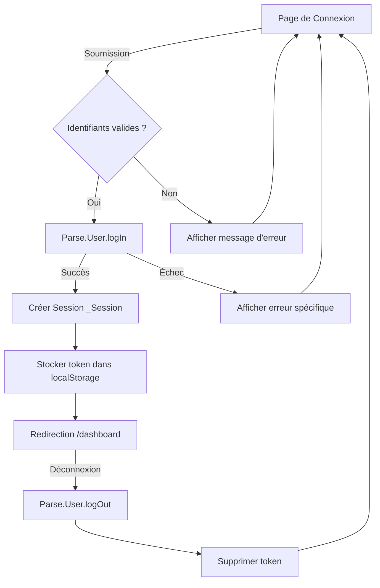

 - **preparation**: 
   - [x] lancer le script: getParseData.sh et ensuite lire le fichier data-model.md.
   - [x] lire le contenu du dossier guides/. Tous les fichiers.
- **action  à faire en RESPECTANT les guides** : # **📌 Feature : Gestion des Comptes Utilisateurs et Authentification**

---

## **📋 User Story (US)**
**Titre** : US002 - Gestion complète des comptes utilisateurs avec authentification Parse Server
**En tant que** [Administrateur/Utilisateur]
**Je veux** gérer les comptes utilisateurs (création, authentification, récupération de mot de passe)
**Afin de** sécuriser l'accès à l'application et permettre une gestion centralisée des utilisateurs.

### **Critères d'acceptation** (Gherkin)

#### **Scénario 1 : Connexion utilisateur réussie**
```gherkin
Scénario : Connexion avec identifiants valides
  Étant donné que je suis sur la page de connexion (/login)
  Quand je saisis un email enregistré "comptabilite@adti06.com"
    Et que je saisis le mot de passe correct
    Et que je clique sur "Se connecter"
  Alors une requête Parse.User.logIn est envoyée
    Et un token de session est créé dans la classe _Session
    Et je suis redirigé vers le tableau de bord (/dashboard)
    Et un cookie de session est stocké avec le token Parse
```

#### **Scénario 2 : Échec de connexion - Identifiants invalides**
```gherkin
Scénario : Tentative de connexion avec mot de passe incorrect
  Étant donné que je suis sur la page de connexion
  Quand je saisis un email valide
    Et que je saisis un mot de passe incorrect
    Et que je clique sur "Se connecter"
  Alors je vois un message d'erreur "Email ou mot de passe incorrect"
    Et le champ mot de passe est mis en surbrillance rouge (Tailwind: border-red-500)
    Et je reste sur la page de connexion
```

#### **Scénario 3 : Récupération de mot de passe**
```gherkin
Scénario : Demande de réinitialisation de mot de passe
  Étant donné que je suis sur la page de connexion
  Quand je clique sur "Mot de passe oublié ?"
    Et que je saisis mon email enregistré
    Et que je clique sur "Envoyer le lien de réinitialisation"
  Alors une requête Parse.User.requestPasswordReset est envoyée
    Et un email est envoyé avec un lien de réinitialisation
    Et un message "Lien de réinitialisation envoyé à votre email" s'affiche
```

#### **Scénario 4 : Gestion des sessions utilisateur**
```gherkin
Scénario : Déconnexion utilisateur
  Étant donné que je suis connecté et sur n'importe quelle page
  Quand je clique sur "Déconnexion" dans le menu utilisateur
  Alors une requête Parse.User.logOut est envoyée
    Et le token de session est invalidé
    Et je suis redirigé vers la page de connexion
    Et tous les cookies de session sont supprimés
```

---

## **🎨 Écrans ASCII**

### **Écran 1 : Page de Connexion**
```plaintext
+---------------------------------------------------+
|                CONNEXION                           |
+---------------------------------------------------+
|                                                   |
| [Champ: Email] (type="email", placeholder="votre@email.com") |
| [Champ: Mot de passe] (type="password", placeholder="••••••••") |
|                                                   |
| [✅] Se souvenir de moi                           |
|                                                   |
| [Bouton: Se connecter] (Alpine.js: @click="login()") |
| [Lien: Mot de passe oublié ?]                     |
| [Lien: Créer un compte]                           |
|                                                   |
| Icône: <i class="lni lni-lock-alt" style="color: #0ea5e9"></i> |
+---------------------------------------------------+
```

**Notes** :
- Style Tailwind : `bg-sky-500 hover:bg-sky-700 text-white` pour le bouton
- Icône LineIcons (lni-lock-alt) en couleur sky-900
- Validation Alpine.js : désactivation du bouton si champs vides

### **Écran 2 : Page de Récupération de Mot de Passe**
```plaintext
+---------------------------------------------------+
|           MOT DE PASSE OUBLIÉ                     |
+---------------------------------------------------+
|                                                   |
| [Champ: Email] (type="email")                   |
|                                                   |
| [Bouton: Envoyer le lien] (Alpine.js: @click="sendResetLink()") |
| [Lien: Retour à la connexion]                     |
|                                                   |
| Icône: <i class="lni lni-envelope" style="color: #0ea5e9"></i> |
+---------------------------------------------------+
```

---

## **🔄 Diagramme Mermaid - Flux d'Authentification**



---

## **📝 Fonctions à Développer (Alpine.js)**

### **loginUser**
**Params** :
- `credentials` (object) : `{ email: string, password: string, rememberMe: boolean }`

**Description** :
- Envoie une requête `Parse.User.logIn` via `parseAxios`
- Gère les erreurs Parse (code 101 = identifiants invalides, 200 = email non vérifié)
- Stocke le token de session et l'ID utilisateur dans `localStorage` si rememberMe = true
- Redirige vers le tableau de bord en cas de succès

**Retour** :
- `{ success: boolean, user: Parse.User | null, error: { code: number, message: string } | null }`

**Exemple d'implémentation** :
```javascript
async function loginUser(credentials) {
    try {
        const response = await Alpine.store('parseAxios').post('/login', {
            username: credentials.email,
            password: credentials.password
        });
        
        if (credentials.rememberMe) {
            localStorage.setItem('parseToken', response.data.sessionToken);
            localStorage.setItem('userId', response.data.objectId);
        }
        
        return { success: true, user: response.data };
    } catch (error) {
        return { 
            success: false, 
            error: { 
                code: error.response?.data?.code || 0, 
                message: error.response?.data?.error || 'Erreur de connexion'
            } 
        };
    }
}
```

---

### **requestPasswordReset**
**Params** :
- `email` (string) : Adresse email de l'utilisateur

**Description** :
- Envoie une requête `Parse.User.requestPasswordReset` via `parseAxios`
- Valide que l'email existe dans la base de données
- Affiche un message de confirmation (même si l'email n'existe pas pour des raisons de sécurité)

**Retour** :
- `{ success: boolean, message: string }`

---

### **logoutUser**
**Params** :
- Aucun

**Description** :
- Envoie une requête `Parse.User.logOut` via `parseAxios`
- Supprime le token de session du `localStorage`
- Redirige vers la page de connexion

**Retour** :
- `{ success: boolean }`

---

### **checkSession**
**Params** :
- Aucun

**Description** :
- Vérifie si un token de session valide existe dans `localStorage`
- Valide le token auprès de Parse Server
- Redirige vers le tableau de bord si la session est valide

**Retour** :
- `{ isValid: boolean, user: Parse.User | null }`

---

## **🗃️ Classes Parse Utilisées**

### **_User** (Classe système Parse)
```javascript
{
    objectId: String,          // ID unique de l'utilisateur
    username: String,           // Email de l'utilisateur
    email: String,              // Email (dupliqué pour compatibilité)
    password: String,           // Mot de passe haché
    emailVerified: Boolean,     // Email vérifié
    createdAt: Date,           // Date de création
    updatedAt: Date,           // Date de dernière mise à jour
    ACL: ACL                   // Contrôle d'accès
}
```

### **_Session** (Classe système Parse)
```javascript
{
    objectId: String,          // ID unique de la session
    sessionToken: String,       // Token de session
    user: Pointer(_User),      // Référence à l'utilisateur
    expiresAt: Date,           // Date d'expiration
    createdWith: Object        // Méthode de création (login/signup)
}
```

---

## **🔐 Règles de Sécurité et Validation**

1. **Validation des champs** :
   - Email : format valide et existence dans la base
   - Mot de passe : minimum 8 caractères (recommandé : 1 majuscule, 1 chiffre)
   - Token de session : durée de vie maximale de 1 an

2. **Gestion des erreurs** :
   - Code 101 : Email ou mot de passe incorrect
   - Code 200 : Email non vérifié
   - Code 201 : Mot de passe incorrect
   - Code 202 : Compte désactivé

3. **Stockage sécurisé** :
   - Tokens stockés dans `localStorage` avec préfixe sécurisé
   - Nettoyage automatique des sessions expirées
   - Pas de stockage de mots de passe en clair

4. **Conformité aux règles de développement** :
   - Utilisation exclusive de `parseAxios` pour les requêtes Parse
   - Pas de JavaScript vanille - uniquement Alpine.js
   - Couleurs principales : sky-500 pour les boutons, sky-900 pour les icônes
   - Icônes LineIcons uniquement
   - Chaque page HTML a son fichier `pageState.js` correspondant

---

## **📊 Exemples de Données**

### **Utilisateur valide** :
```json
{
    "objectId": "ds8xFefKXg",
    "username": "comptabilite@adti06.com",
    "email": "comptabilite@adti06.com",
    "emailVerified": true,
    "createdAt": "2026-02-06T14:30:50.528Z",
    "updatedAt": "2026-02-06T14:30:50.528Z"
}
```

### **Session active** :
```json
{
    "objectId": "PH2AG1kGoy",
    "sessionToken": "r:b530d32b65f109bf2ba5fc2acaaf31b1",
    "user": {
        "__type": "Pointer",
        "className": "_User",
        "objectId": "ds8xFefKXg"
    },
    "expiresAt": "2027-02-07T19:48:05.700Z",
    "createdWith": {
        "action": "login",
        "authProvider": "password"
    }
}
```

---

## **🎯 Intégration avec l'Interface Existante**

### **Fichier pageState.js requis** :
```javascript
document.addEventListener('alpine:init', () => {
    Alpine.data('loginState', () => ({
        email: '',
        password: '',
        rememberMe: false,
        error: null,
        
        async login() {
            const result = await loginUser({
                email: this.email,
                password: this.password,
                rememberMe: this.rememberMe
            });
            
            if (!result.success) {
                this.error = result.error.message;
                return;
            }
            
            window.location.href = '/dashboard';
        },
        
        requestPasswordReset() {
            // Logique de récupération de mot de passe
        }
    }));
});
```

### **Intégration HTML** :
```html

<script src="{{ url_for('static', filename='js/templates/auth/login/loginState.js') }}"></script>

```

---

## **📋 Checklist de Vérification (selon checkcontrole.md)**

- [x] Aucune classe CSS maison - uniquement du TailwindCSS
- [x] Couleur principale est le sky-500
- [x] Aucun JS vanille - uniquement du Alpine.js
- [x] Chaque fichier HTML a son équivalent en pageState.js
- [x] Fichiers pageState.js commencent par `document.addEventListener('alpine:init', ...)`
- [x] Appels à Parse en REST utilisant axios.instance parseAxios
- [x] Toutes les icônes sont en LineIcons - couleur sky-900
- [x] Toutes les routes sont bien définies dans app.py
- [x] Utilisation du blueprint /script/ pour les scripts backend
- [x] Tous les fichiers HTML utilisent base-app.html (avec authentification)

---

## **🚀 Prochaines Étapes**

1. **Développement Frontend** :
   - Créer le template HTML pour la page de connexion
   - Développer le fichier `loginState.js` avec Alpine.js
   - Intégrer les icônes LineIcons (lni-lock-alt, lni-envelope)

2. **Développement Backend** :
   - Vérifier les routes Flask dans app.py pour /login
   - Configurer le blueprint /script/ pour la gestion des sessions
   - Implémenter les scripts de validation des tokens

3. **Tests** :
   - Exécuter `check_routes.js` pour vérifier les routes
   - Tester l'authentification avec des utilisateurs existants
   - Valider le stockage sécurisé des tokens

4. **Documentation** :
   - Mettre à jour le fichier verification_report.md
   - Documenter les nouvelles fonctionnalités dans les guides
